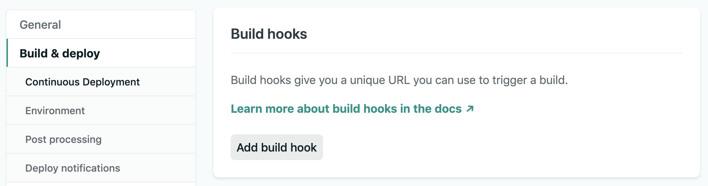
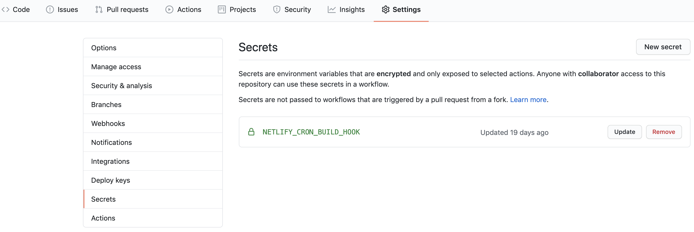

# Incrementally building the web

A few weeks ago I rewrote [Junior Developer Jobs](https://juniordevjobs.netlify.app/). It's a modest website that lists recent tweets advertising junior developer positions. If you're looking for a gig in these turbulent times, I hope it helps! Little did I know that this small side project would heavily influence my mindset on the future of developing web apps. It's an exciting time to be a web developer. I want to share with you my predictions, as well as some practical tips on how to dip your toes into this what-is-old-is-new-again static world.

For a moment, think about how you would create a site like Junior Developer Jobs. There's two approaches that might come to mind:

1. Fetch a list of tweets from Twitter each time the site is accessed; or
2. Fetch a list of tweets from Twitter. Store them in a database. Retrieve the tweets from the database when the site is accessed. Periodically update the stored tweets.

What are the advantages of the first approach? We can be certain that the tweets shown are as recent as possible. Disadvantages? A request needs to be made to the Twitter API each time the site is accessed. This request takes some additional time. More worryingly, we run the risk of being rate limited if our site has a spike in views or is maliciously targeted.

So, which approach did I opt for? Initially I settled on the second. Then I tried a third approach, and my view on web development has never quite been the same.

## A static resurgence

Static website frameworks have seen a remarkable surge in popularity. In the React ecosystem, arguably the forerunner in this space (and the one I am most familiar with) is [Gatsby](https://www.gatsbyjs.org/). It leverages React and a community driven ecosystem of _plugins_ - packages that make it easy to integrate external data sources (e.g. APIs) with a Gatsby website. Gatsby sites need to be _built_ before they are deployed. At compile time, the build system makes all the API calls necessary to transform every React page into a HTML document.

The benefits of static sites are well documented. They don't require complex servers, they can utilise distributed CDNs, the perceived performance is (in Gatsby's own words) _blazing fast_, and they make SEO a breeze compared to client-side JavaScript heavy Create React App-esque sites.

You'd be forgiven for thinking that static sites can do no wrong. That is, until you realise that you need the data on your site to be dynamic. At face value this seems problematic - each time the data is updated, the site needs to be rebuilt. It's therefore unsurprising that Gatsby is commonly associated with blogs, marketing sites and wikis. These are the kinds of websites where the content is updated infrequently and new content is typically added manually.

How can we use Gatsby as a dynamic, data driven website?

## Hooks, actions & plugins

For Junior Developer Jobs to work with Gatsby, I needed to automate the process of fetching new tweets and rebuilding the site. I'll explain how I did this using [Netlify Build Hooks](https://docs.netlify.com/configure-builds/build-hooks/) and [GitHub Actions](https://github.com/features/actions). Similar services will work just as well too.

### Netlify build hooks

Netlify's build hook is a uniquely generated URL that when triggered with a HTTP POST request rebuilds the site. You can generate a new build hook by clicking the Add build hook button at Settings > Build & Deploy > Continuous Deployment > Build Hooks.



If you want to test making a POST request, you can use [Postman](https://www.postman.com/), [Postwoman](https://postwoman.io/) or cURL:

```bash
curl -X POST -d '{}' https://api.netlify.com/build_hooks/XXXXXXXXXXXXXXX
```

I didn't have a use for it in this project, but it's also possible to send a string in the payload of the POST request which can then be accessed [in the build process via an environmental variable](https://docs.netlify.com/configure-builds/build-hooks/#payload).

### GitHub actions

Netlify's build hook lets us trigger a new build but we still need to automate and schedule when the hook should be triggered - that's where GitHub Actions comes in. GitHub Actions is essentially GitHub's solution for continuous integration and deployment. We will create a new workflow that uses cURL to make a POST request to the Netlify build hook URL every hour. If a scheduled event is not the best fit for your project, there are [many other events to choose from](https://docs.github.com/en/actions/reference/events-that-trigger-workflows#webhook-events).

One of the benefits of using GitHub Actions is that the workflow can be created in the same repository as the project. In the root of your project, create a new YAML file at `.github/workflows/hourly-build.yml`

```yaml
name: Hourly build
on:
  schedule:
    - cron: "0 * * * *"
jobs:
  build:
    runs-on: ubuntu-latest
    steps:
      - name: Trigger Netlify build hook
        run: curl -X POST -d {} "https://api.netlify.com/build_hooks/${TOKEN}"
        env:
          TOKEN: ${{ secrets.NETLIFY_CRON_BUILD_HOOK }}
```

To briefly explain this workflow - the name of the workflow is _Hourly build_. It runs on a schedule. 0 \* \* \* \* is the [cron](https://en.wikipedia.org/wiki/Cron) syntax for run every hour. You can change this to a different interval if needed, and I've found [Crontab Guru](https://crontab.guru/every-1-hour) to be a useful tool to help with the syntax. The workflow runs a Ubuntu container that makes a cURL request to the Netlify build hook.

You might have also noticed that I removed the last part of the URL from the build hook that identifies the Netlify project and replaced it with an environmental token. This is because anyone who has access to the full URL can start a new build of your site. It's safer to store this identifier as a GitHub secret which is only accessible to collaborators of the repository. In a GitHub repository, you can add a new secret by going to Settings > Secrets. Name the secret `NETLIFY_CRON_BUILD_HOOK`. The value should be the extracted part of the Netlify build hook URL.



As we've included our workflow in the special `.github/workflows` folder, Github will recognise it automatically. You should see the workflow listed under the _Actions_ tab in the repository. With this workflow set up, our project will rebuild and deploy on Netlify every hour.

### Netlify plugins

When Gatsby builds a site, it generates assets and places them in a public folder. The public folder, along with a cache folder, are used to keep track of the assets that make up the site. By default, Netlify does not keep the Gatsby cache. This means that each build process starts from scratch.

We can use a [Netlify build plugin by Jason Lengstorf](https://github.com/jlengstorf/netlify-plugin-gatsby-cache) to persist the Gatsby cache between builds. This can significantly reduce the build time and is incredibly easy to do - it's a simple one-click install through the UI.

## Building on a budget

How far can we get on a shoestring budget for a hobby project?

Netlify can host the website and also offers 300 build minutes per month for free. If we assume a site takes one minute to build (we'll come back to whether this is a realistic assumption), Netlify can build the site 300 times a month or roughly 10 times a day. If you're willing to go all in on Gatsby - their own offering, [Gatsby Cloud](https://www.gatsbyjs.com/pricing), offers a sizeable bump to 25 builds a day. Reassuringly, both Netlify and Gatsby Cloud don't require credit card registration for their free tiers.

GitHub Actions offers a generous 2,000 minutes per month for private repositories and free usage for public repositories. In my own experience, I've found that making a cURL request typically takes around 2 seconds. That's a staggering ~1,296,000 requests per month for private repositories, dwarfing the number of monthly requests that we would actually ever make.

In short, budget is no barrier to entry.

## A look to the future

I'm bullish that frequently rebuilt websites will continue to grow in popularity and be a better fit for a wider range of use cases. However, I'm also not oblivious to the challenges. Unlike Junior Developer Jobs, most applications will need a database or headless CMS. This will require some additional initial set up, but generally they can be treated as just another data source that the Gatsby build process draws upon. There are already plugins for popular options such as [PostgreSQL](https://www.gatsbyjs.org/packages/gatsby-source-pg/) and [Wordpress](https://www.gatsbyjs.org/packages/gatsby-source-wordpress/).

Nonetheless, there are some things that simply cannot be generated at build time. For example, the options selected on a settings page is something that is unique to the user that is currently logged in. The typical approach to solving this issue is to statically render as much of the page as possible, and then _hydrate_ the application state using a client-side fetch request. It's not as good as a pure static page, but the first initial render (which is often the bulk of the page) remains blazing fast. For certain use cases, such as real time applications, a different website architecture may be preferable. And you know what? That's fine too - I'm a strong believer in using the best tool for the job.

In the previous section I made the assumption that a Gatsby site takes around a minute to build. For a small site, with a few data sources, that's in the ball park. For larger sites, think of an e-commerce site with hundreds of product pages and images, I've heard of initial builds taking anywhere between 20 minutes to over an hour.

The Gatsby team is actively working on reducing build times. One of the main ways they are tackling this problem is to ensure that Gatsby only rebuilds the parts of a website that have actually been modified. This is commonly referred to as incremental or conditional page builds. For now, it's an experimental feature that you can [try today through an environmental variable](https://www.gatsbyjs.org/docs/conditional-page-builds/). If you're willing to go all in with Gatsby Cloud, the weather gods offer up to 20x faster build times and 10-1000x faster incremental builds. I'm excited for the future when incremental builds for large websites might well be in the range of milliseconds. Infrastructure challenges that have long haunted web developers such as scaling, database replication and website stability may face a new kryptonite.

## Go forth and incrementally build!

In the [2019 State of JavaScript survey](https://2019.stateofjs.com/back-end/gatsby/), 35% of the respondents indicated that they had heard of Gatsby and would like to learn it. If you're in a similar position, there's never been a better time. Not only for blogs and personal portfolios, but dynamic incrementally built data driven websites too.
